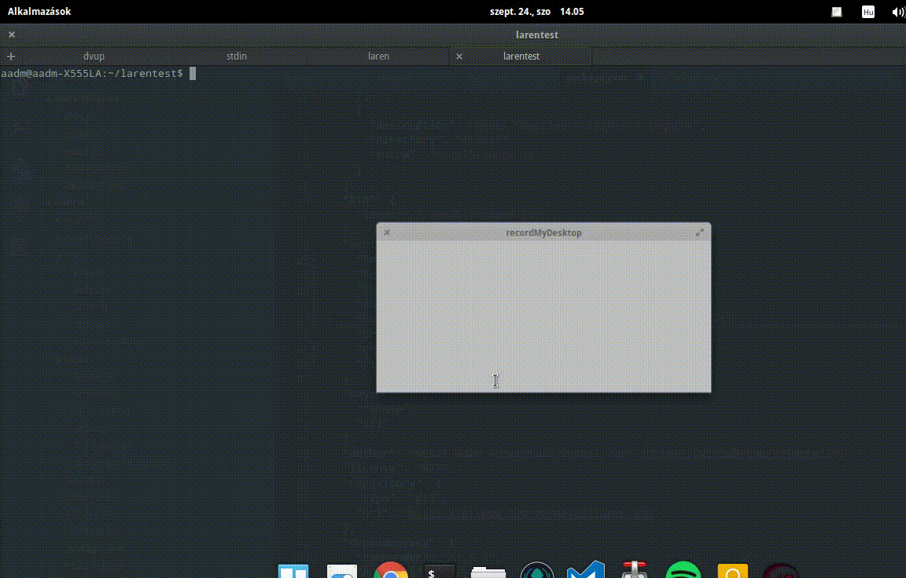

[](https://travis-ci.org/devmetal/laren)

<!-- TITLE/ -->

<h1>laren</h1>

<!-- /TITLE -->




<!-- DESCRIPTION/ -->

Command line tool for renaming files with custom function expression

<!-- /DESCRIPTION -->


<h1>Install</h1>

```bash
npm install laren -g
```

<h1>Usage</h1>

```bash
laren <pattern> [function] <options>
```

<h2>[pattern]</h2>
This is a glob pattern.

<h2>[function]</h2>
The function parameter take 2 argument, filename and the index. You can write any function that you want.
In the current version, the function is an optional argument. If any function provided by args, that will be used in files.
If you don't give the function you have to type in terminal with an :exit (see example below) or you have to use unix pipe to
send your function to stdin.

<h2>Options</h2>

<h3>-t --test</h3>
Run script in test mode. No modify the files but print out the matches and names. If you run the command without this switch,
the files will be renamed.

<h1>Usage example</h1>

```bash
laren -t ./**/* "(f, i) => 'file' + i"
./filea ==> file0
./fileb ==> file1
./filec ==> file2
Tests done!
```

```bash
laren -t ./**/*
(f,i) => 'file' + i;
:exit
./filea ==> file0
./fileb ==> file1
./filec ==> file2
Tests done!
```

```bash
echo "(f,i) => 'file' + i;" | laren -t ./**/*
./filea ==> file0
./fileb ==> file1
./filec ==> file2
Tests done!
```
